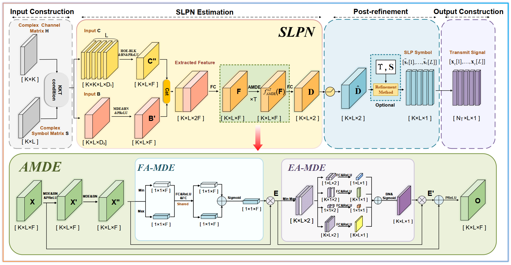

# 📡 SLP-TENN

[](https://github.com/zhangjinshuoseu-create/SLP_TENN)
[](https://arxiv.org/abs/2510.02108)
[](https://github.com/{user}/{repo}/blob/main/LICENSE)

This repository provides the open-source code for the paper **"[Unlocking Symbol-Level Precoding Efficiency Through Tensor Equivariant Neural Network](https://arxiv.org/abs/2510.02108)"**. Building on the **tensor equivariant neural network (TENN)**, the paper proposes an **attention-based multidimensional equivariant (AMDE)** module, and uses it to design a **unified deep-learning framework for symbol-level precoding (SLP)** — one that covers both the **CIZF** (SINR-balancing) and **CIMMSE** criteria, both **PSK and QAM** constellations, and both **perfect and imperfect CSI** (robust SLP under channel aging). The framework retains most of the performance gains of optimal SLP while cutting the online per-symbol complexity to **linear**, achieving roughly an **80× GPU speedup** over conventional SLP.

---

## 📄 Get the Paper

- **arXiv (with detailed appendix)** — [arXiv:2510.02108](https://arxiv.org/abs/2510.02108)

---

## 🧠 Core Concepts

This repository provides a **low-complexity, deep-learning-based framework for symbol-level precoding (SLP)**. Its core is a tensor-equivariant network that learns the SLP **perturbation factors** directly, replacing the expensive per-symbol iterative optimization used by conventional SLP. The paper first analyzes the SLP problem and proves that the mapping from the problem information to its optimal solution is **tensor equivariant (TE)** — permuting users or symbols at the input permutes the solution in exactly the same way. By matching the network's parameter-sharing pattern to this TE structure, the resulting networks obtain low complexity and strong generalization. Two networks are designed accordingly:

- **SLPN** — for **perfect CSI**.
- **RSLPN** — for **imperfect CSI**, a two-stage pipeline (RSLPN-A + RSLPN-B) that realizes the robust MMSE design while preserving the same TE.

**Tensor Equivariance (TE)** generalizes permutation equivariance to high-dimensional tensors, and the basic modules include:

- **Multidimensional Equivariance (MDE)**: permuting each tensor dimension independently produces the same permutation at the output.
- **High-Order Equivariance (HOE)**: the same permutation is applied simultaneously across multiple dimensions.
- **Multidimensional Invariance (MDI)**: the output is unchanged under permutations along specified dimensions.

---

## ✨ Key Features

- 🌱 **Scalable** — generalizes across different user numbers $K$ and block lengths $L$ without retraining; a single trained network adapts to unseen configurations.
- ⚡ **Efficient** — replacing the iterative NNLS solver; roughly an 80× GPU speedup over conventional SLP in typical settings.
- 🧱 **Model-driven** — the network only learns the perturbation factors; the transmit signal is recovered in closed form.
- 🔁 **Block-parallel** — an entire symbol block is processed in a single forward pass.
- 📶 **General** — one architecture covers CIZF & CIMMSE, PSK & QAM, and perfect & imperfect CSI.

---


## 🔧 Network / Module Introduction

The framework is built on three **basic tensor-equivariant (TE) modules**, on top of which the **AMDE** module and the **SLPN / RSLPN** networks are constructed.

### The Basic TE Model

| Module 🧩 (abbr.) | Function ⚙️ | Dimensions ♾️ | Code |
|:--|:--|:--|:--|
| **MDE** | The equivalent linear module when any fully connected layer satisfies permutation equivariance across an arbitrary number of dimensions. | **In**: $\mathrm{bs}\times M_1\times \dots \times M_N\times D_I$ <br> **Out**: $\mathrm{bs}\times M_1\times \dots \times M_N\times D_O$ | `MDE_Module`, `MDE_Module_LowFLOPs` in [`models/te_module.py`](models/te_module.py) |
| **HOE** | The equivalent linear module when an arbitrary fully connected layer exhibits equivariance to identical permutations across multiple input and output dimensions (taking 1-2-order equivariance as an example). | **In**: $\mathrm{bs}\times M\times D_I$ <br> **Out**: $\mathrm{bs}\times M\times M\times D_I$ | `HOE_2_1_Module` in [`models/te_module.py`](models/te_module.py) |
| **MDI** | A nonlinear module based on the attention mechanism that satisfies permutation invariance across an arbitrary number of dimensions. | **In**: $\mathrm{bs}\times M_1\times \dots \times M_N\times D_I$ <br> **Out**: $\mathrm{bs}\times D_O$ | `MDI_Module` in [`models/te_module.py`](models/te_module.py) |

These basic TE layers are the standard building blocks of tensor-equivariant networks. A more detailed introduction to them (MDE, HOE, and especially the attention-based MDI) can be found in the **[TENN Toolbox](https://github.com/ZJSXYZ/TENN)**.

<p align="center">
  
  <br>
  <em>The overall structure of the SLP framework (Fig. 4 in the paper).</em>
</p>

### AMDE / SLPN / RSLPN

- **AMDE** (`AMDE_Block` / `AMDE_Network` in [`models/te_models.py`](models/te_models.py)) — an MDE module augmented with a lightweight, MDE-compliant **decoupled attention mechanism** (feature attention + equivariant-dimension attention), wrapped in a residual connection.

- **SLPN** (`SLPN` in [`models/prec_models.py`](models/prec_models.py)) — the **symbol-level precoding network for perfect CSI**, designed based on tensor equivariance. Stacking the basic TE layers and AMDE blocks, it approximates the mapping $G(\mathbf{B}_c,\mathbf{C}_c)=\mathbf{D}^\star$ and outputs the perturbation tensor $\mathbf{D}$.

- **RSLPN** (`RSLPN_A` and `RSLPN_B`(=`SLPN`) in [`models/prec_models.py`](models/prec_models.py)) — a deep-learning, tensor-equivariance-based **robust SLP** method that **extends the perfect-CSI framework to imperfect CSI**. It uses two networks: **RSLPN-A** estimates the auxiliary variable $\boldsymbol{\Psi}$, and **RSLPN-B** (sharing SLPN's architecture) estimates $\mathbf{D}$. Training is sequential — train RSLPN-A first, freeze it, then train RSLPN-B.


---

## 🏗️ Project Structure

```
LCSLP_github/
├── models/                        # Networks / TE layers
│   ├── prec_models.py             # SLPN, RSLPN_A, RSLPN_B(=SLPN)
│   ├── te_models.py               # AMDE_Network / AMDE_Block, dim-list helpers
│   └── te_module.py               # MDE / HOE / MDI / FA-MDE / EA-MDE
├── func/                          # Pipeline helpers
│   ├── prec_func.py               # CIR thresholds; B,C construction; robust Υ
│   ├── train_func.py              # Train / test loops (MSE; save predictions)
│   └── init_func.py               # Param containers, DatasetFolder_*, init
├── train_cizf_*.py                # CIZF-DL training entry points
├── test_cizf_*.py                 # CIZF-DL testing entry points
├── train_cimmse_*.py              # CIMMSE-DL training entry points
├── test_cimmse_*.py               # CIMMSE-DL testing entry points
├── train_rcimmse_RSLPN_A.py       # RSLPN-A training 
├── train_rcimmse_RSLPN_B.py       # RSLPN-B training 
├── test_rcimmse_RSLPN.py          # RSLPN testing
├── train_data/                    # (not shipped) place .mat datasets here
├── save_data/                     # (created at runtime) checkpoints & preds
└── README.md
```

---

## 🚀 Usage

Dependencies used by the scripts include PyTorch, NumPy, SciPy (`loadmat` / `savemat`), and `einops`. Training / testing expect a CUDA device index via `gpu_id` (entry scripts use non-negative GPU ids; use CPU only if you change the device string in the training code yourself).

### 1. Prepare data

Data are **not** included in this repository. Place `.mat` files under the `in_folder` path configured in each entry script (default pattern: `./train_data/{EXPERIMENT_NAME}/`). Checkpoints and predictions are written to `./save_data/{EXPERIMENT_NAME}/`.

**CIZF-DL** (example `train_cizf_UE12TX12_QPSK.py`):

| File stem (key) | Expected array layout |
|:--|:--|
| `upsilon_cizf` | `[sample_num, K, K]` complex |
| `symbol_data` | `[sample_num, K, L]` complex |
| `delta_cizf` | `[sample_num, 2K, L]` (loader splits to `[sample_num, K, L, 2]`) |

**CIMMSE-DL** (multi-SNR): `upsilon_cimmse` is `[sample_num, K, K, n_snr]`; `delta_cimmse` is `[sample_num, n_snr, 2K, L]`. Default SNR list in scripts: `{0,5,10,15,20,25,30}` dB.

**RCIMMSE-DL**: `channel_data` `[sample_num, K, N_T]`, `symbol_data` `[sample_num, K, L]`, `U_data`, `omega_data`, plus `psi_data` (for A) or `delta_data` (for B). Scripts use `txlen=50`, `alpha_sim=0.995`, SNR list `{10,...,40}` dB.

Typical split in scripts: CIZF/CIMMSE `n_train=90000`, `n_test=10000`; RSLPN `n_train=55000`, `n_test=5000` (per channel realization before SNR tiling where applicable).

### 2. Train

Hyper-parameters are set **inside** each script (no CLI argparse). Minimal commands:

```bash
# CIZF-DL (QPSK, K=12, N_T=12) — SLPN with d_hidden=4, n_amde_layer=4
python train_cizf_UE12TX12_QPSK.py

# CIMMSE-DL (QPSK, K=12, N_T=14)
python train_cimmse_UE12TX14_QPSK.py

# RCIMMSE-DL: train A, then B
python train_rcimmse_RSLPN_A.py
python train_rcimmse_RSLPN_B.py

```

Checkpoints are saved as `./save_data/.../TE.pth.tar` (`net_name='TE'`).

### 3. Test

```bash
python test_cizf_UE12TX12_QPSK.py
python test_cimmse_UE12TX14_QPSK.py
python test_rcimmse_RSLPN.py
```

Tests load `TE.pth.tar` from the corresponding `out_folder`, print Test MSE, and write predicted `delta` (and `psi` for robust) `.mat` files for the external MATLAB pipeline.


---

## 📚 Citation

If you find this repository useful, please cite:

```bibtex
@misc{zhang2025unlockingsymbollevelprecodingefficiency,
      title={Unlocking Symbol-Level Precoding Efficiency Through Tensor Equivariant Neural Network}, 
      author={Jinshuo Zhang and Yafei Wang and Xinping Yi and Wenjin Wang and Shi Jin and Symeon Chatzinotas and Björn Ottersten},
      year={2025},
      eprint={2510.02108},
      archivePrefix={arXiv},
      primaryClass={eess.SP},
      url={https://arxiv.org/abs/2510.02108}, 
}
```


## 📝 License

Released under the [MIT License](LICENSE).

---


